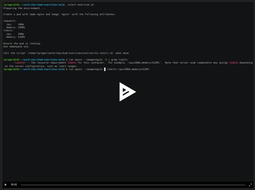

# CKAD hands-on exercises

## TL;DR
```
sudo snap install microk8s --classic
sudo microk8s.enable dns
git clone https://github.com/ludwigprager/ckad-exercises.git
./ckad-exercises/ex01/start-exercise.sh 
```

## Multi-Container Pods (10%)
## Pod Design (20%)
[Exercise 01: requests and limits](./ex01/)  
[Exercise 02: environment variables](./ex2/)  
[Exercise 07: labels and annotations](./ex7/)  
[Exercise 10: cron jobs](./ex10/)  
## State Persistence (8%)
[Exercise 05: hostPath](./ex5/)  
[Exercise 06: hostPath in a persistent volume](./ex6/)  
## Configuration (18%)
[Exercise 03: rollout, rollback, record](./ex3/)  
[Exercise 04: rollout](./ex4/)  
## Observability (18%)
[Exercise 09: readiness and liveliness](./ex9/)  
## Services and Networking (13%)
[Exercise 08: ClusterIP and network policy](./ex8/)  

---

If you have [microk8s](https://microk8s.io/) on your computer you can try these CKAD
exercises by running the 'start-exercise.sh' scripts in the different subdirectories.  

Run the 'verify-result.sh' scripts to check if you passed the test.
It will show you the solution in case you failed to solve the exercise.

# Screen Cast
[](https://asciinema.org/a/404891)
